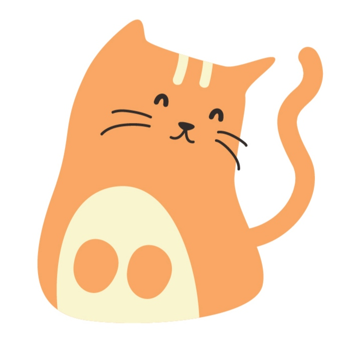

# ArruBot
A Discord Bot written in Java.

> Bot from a cat lover who thinks about his cat 24/7
---

<div id="top"></div>

<!-- PROJECT LOGO -->
<div align="center">
  <a href="https://github.com/clawbhaiya/ArruBot">
    
  </a>
</div>

---

## Building
- Dependencies

`JDK17` and `Maven`.

That's it. No other bloat.

- Clone this repository
```sh
git clone https://github.com/clawbhaiya/ArruBot.git
```

- Compiling and Running
```sh
mvn compile
mvn clean install
mvn exec:java -Dexec.mainClass=arru.Arru
```

- Or Package it into a single executable JAR file
```sh
mvn clean compile assembly:single
```